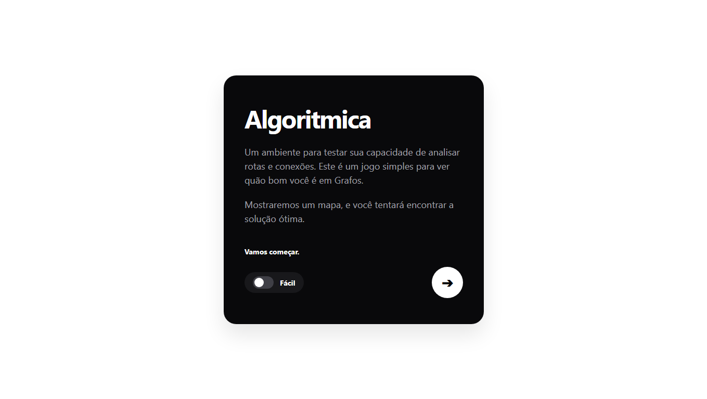
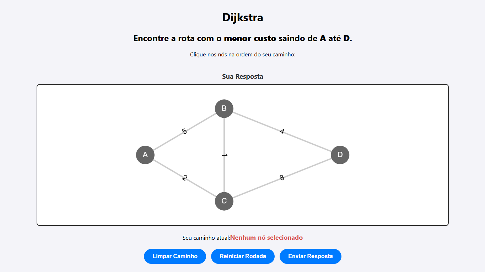
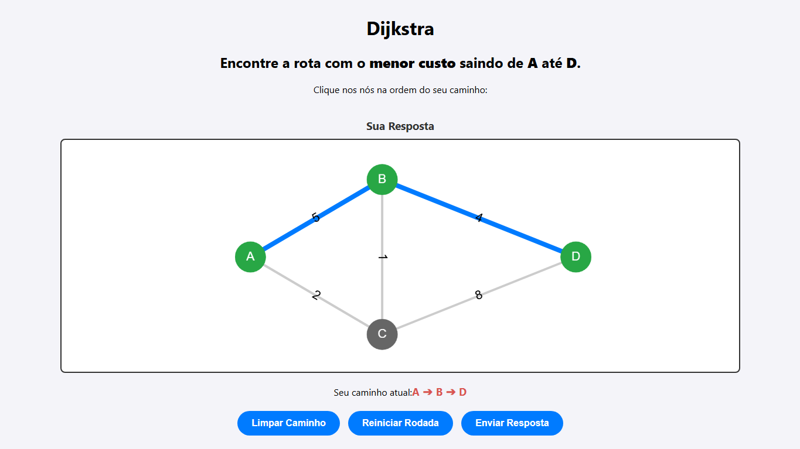
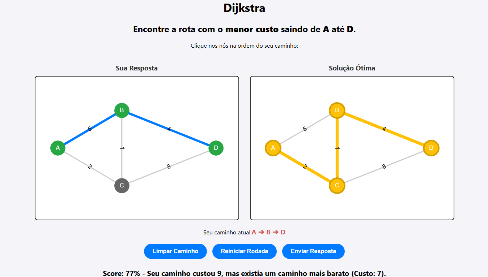
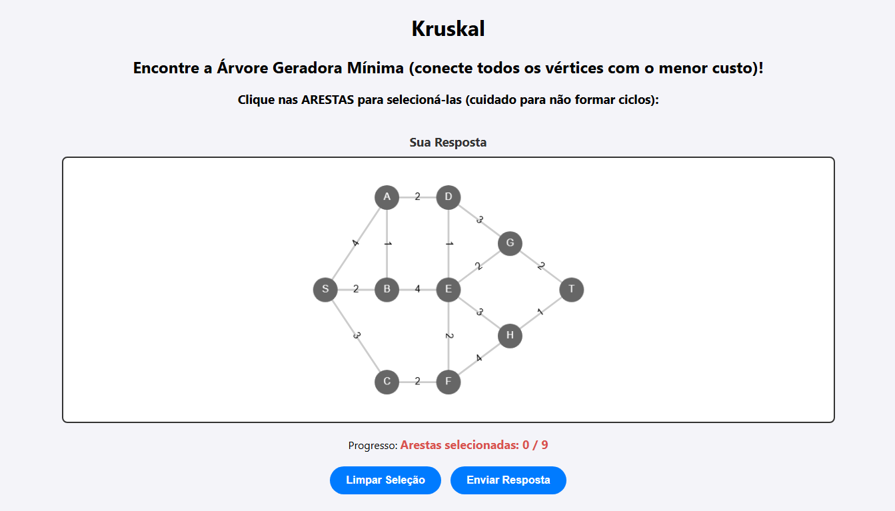
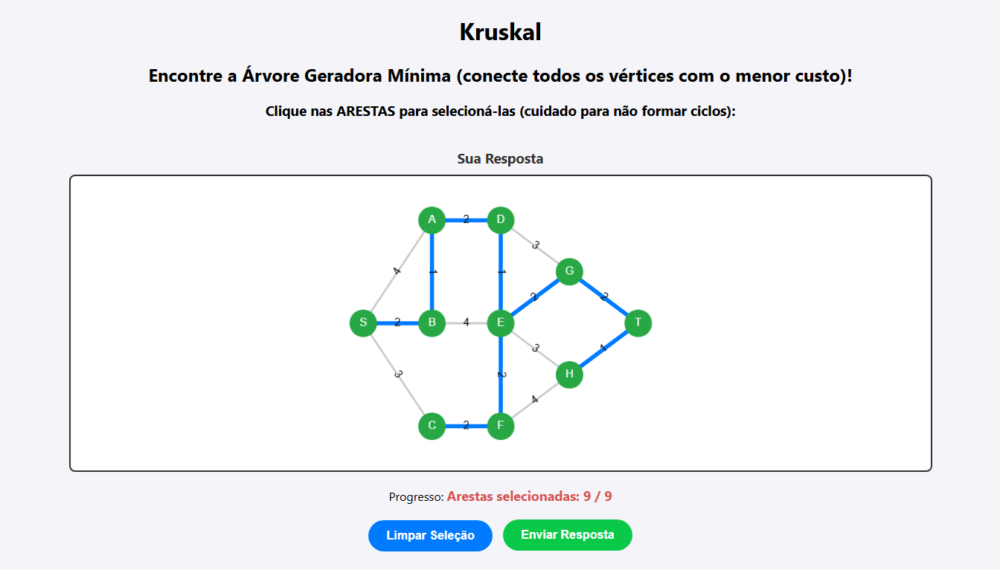
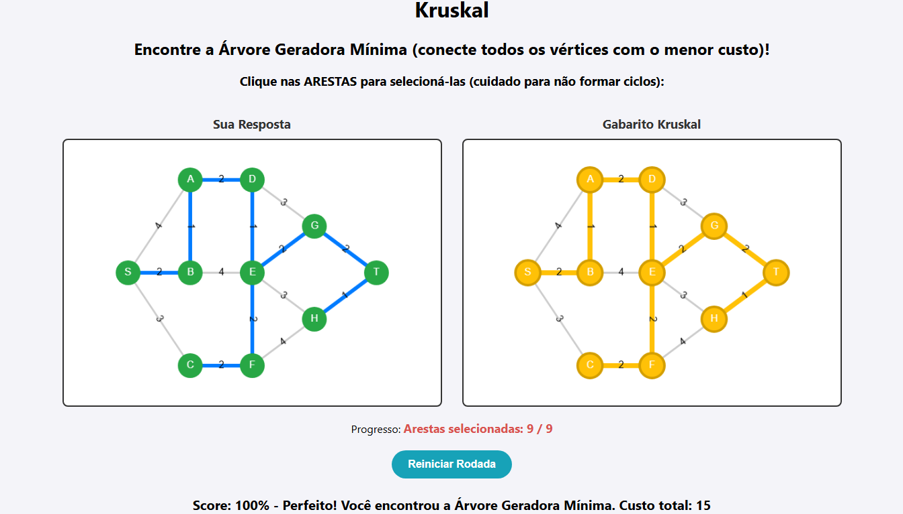

<table>
  <tr>
    <td valign="top">
      <h1><font size="6"><b>Algoritmica</b></font><br></h1>
      <h3><b>Número da Lista:</b> 17<br></h3>
      <h3><i>Conteúdo da disciplina:</i> Grafos<br></h3>
      <h3>Alunos</h3>
      <table>
        <tr>
          <th>Matrícula</th>
          <th>Aluno</th>
        </tr>
        <tr>
          <td>251013660</td>
          <td>Matheus Moretti Soares</td>
        </tr>
        <tr>
          <td>251019771</td>
          <td>Daniel Filipe Borges de Oliveira</td>
        </tr>
      </table>
    </td>
    <td valign="top" align="center">
      
    </td>
  </tr>
</table>

---

## Sobre
O Algoritmica é uma **ferramenta educacional interativa** desenvolvida para ensinar algoritmos de grafos na prática, no formato de **minigames**. O usuário interage com uma interface visual, selecionando nós e caminhos, e o sistema avalia suas escolhas comparando-as com a solução ótima gerada pelos **algoritmos** clássicos.

- Atualmente Implementados: Dijkstra & Kruskal

**Em breve: BFS, DFS, Kosaraju(Componentes Fortemente Conectados)...**

## Screenshots

<table align="center">
  <!-- LINHA 1 -->
  <tr>
    <td align="center">
      <b>1. Dijkstra</b><br>
      
    </td>
    <td align="center">
      <b>2. Seleção de Caminho(Dijkstra)</b><br>
      
    </td>
  </tr>
  
  <!-- LINHA 2 -->
  <tr>
    <td align="center">
      <b>3. Exibindo Gabarito(Dijkstra)</b><br>
      
    </td>
    <td align="center">
      <b>4. Kruskal</b><br>
      
    </td>
  </tr>
  
  <!-- LINHA 3 -->
  <tr>
    <td align="center">
      <b>5. Seleção de Caminho(Kruskal)</b><br>
      
    </td>
    <td align="center">
      <b>6. Exibindo Gabarito(Kruskal)</b><br>
      
    </td>
  </tr>
</table>

## Instalação

Linguagens: Python e JavaScript<br>
Framework: FastAPI<br>

**Pré-requisitos:** É necessário ter o Python e o gerenciador de pacotes `pip` instalados no seu computador.

**1. Instale a linguagem Python:** Acesse o [Site Oficial do Python](https://www.python.org/downloads/) e faça o download para seu sistema operacional

**OBS:**
Para verificar a instalação abra o terminal e rode:
```bash
python --version
```
*(Se o comando acima não funcionar, tente digitar `python3 --version`)*.

**2. Verifique a instalação do Pip**
```bash
pip --version
```
*(Se precisar usar o `python3`, verifique com `pip3 --version`)*.

---

Siga o passo a passo abaixo para rodar a aplicação no seu ambiente local.

**1. Clone o repositório:**
```bash
git clone [https://github.com/projeto-de-algoritmos-2026/G17_Grafos_PA-26.2_Algoritmica]
```

**2. Entre na pasta backend do projeto e crie o ambiente virtual(venv):** 
```bash
cd .\backend\ #vai para o diretório backend

python -m venv venv #cria o ambiente virtual
```

**3. Ative o ambiente virtual:**

Windows:
```bash
.\venv\Scripts\activate
```

Linux/Mac:
```bash
source venv/bin/activate
```

**4. Instale as dependências e ligue o servidor (verifique se todos os comandos são executados sem erros no seu terminal):**
```bash
pip install -r requirements.txt #instala as bibliotecas necessárias

python app.py #inicia a aplicação e liga o servidor
```

## Uso
**1. Certifique-se de que o servidor back-end está rodando (passo 4 da instalação).**

**2. Vá até a pasta raiz/front-end do projeto e abra o arquivo index.html no seu navegador de preferência.**

**3. Interaja com a interface visual clicando nos nós e formando caminhos para jogar e testar seus conhecimentos em algoritmos.**

## Outros

### 🛠️ Tecnologias e Bibliotecas Utilizadas
Para garantir um desenvolvimento ágil focado na lógica estrutural, adotamos a seguinte stack:

**Back-end:**
*   **FastAPI:** Framework web em Python utilizado para construir a API RESTful. Ele é o responsável por criar as rotas de comunicação que recebem as tentativas do jogador e devolvem o resultado (score) calculado pelos algoritmos.
*   **Uvicorn:** Servidor web ASGI de alta performance. Atua como o "motor" que roda a aplicação FastAPI no ambiente local.
*   **Pydantic:** Utilizado nativamente pelo FastAPI para validação e tipagem de dados estruturados. Garante que as respostas em JSON enviadas pelo front-end (como a sequência de nós) cheguem perfeitamente formatadas para o Python.

**Front-end:**
*   **Cytoscape.js:** Biblioteca JavaScript Open-Source especializada em renderização e interação de grafos na web. É responsável por desenhar a malha de nós e arestas esteticamente na tela, além de gerenciar todos os eventos de clique e mudança de cor conforme o usuário joga.

## Vídeo de Apresentação

[Link do Vídeo Gravado no Teams](https://unbbr-my.sharepoint.com/:v:/g/personal/251013660_aluno_unb_br/IQDOmUFJX0pNQ5Qo6G6lPPyiAVHMi4vHrXUsYw38PDZBymM?e=GBpeWj&nav=eyJyZWZlcnJhbEluZm8iOnsicmVmZXJyYWxBcHAiOiJTdHJlYW1XZWJBcHAiLCJyZWZlcnJhbFZpZXciOiJTaGFyZURpYWxvZy1MaW5rIiwicmVmZXJyYWxBcHBQbGF0Zm9ybSI6IldlYiIsInJlZmVycmFsTW9kZSI6InZpZXcifX0%3D)
